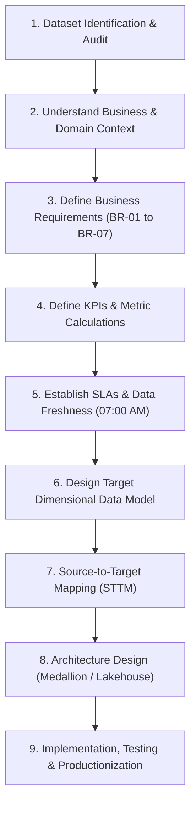
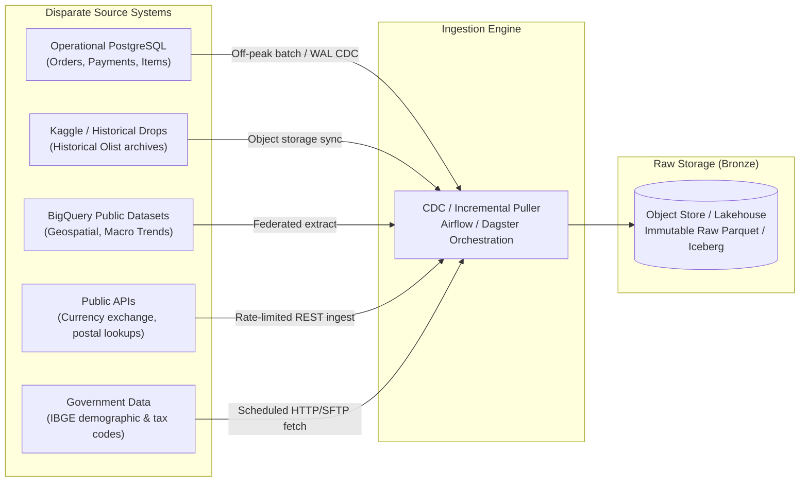
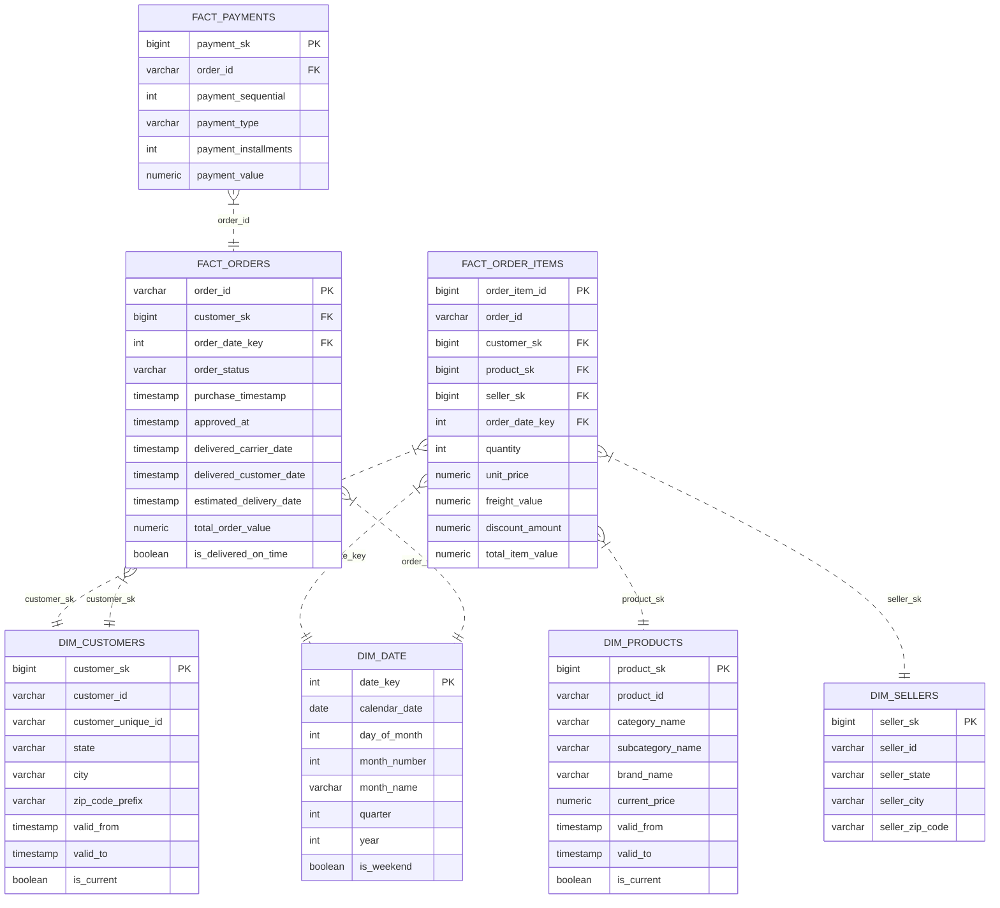
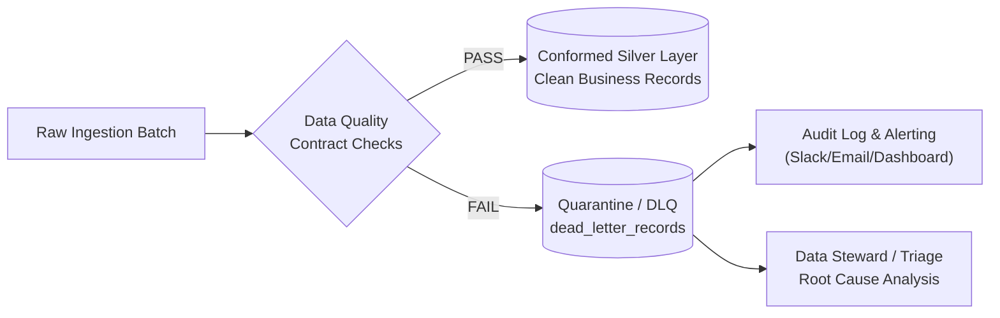
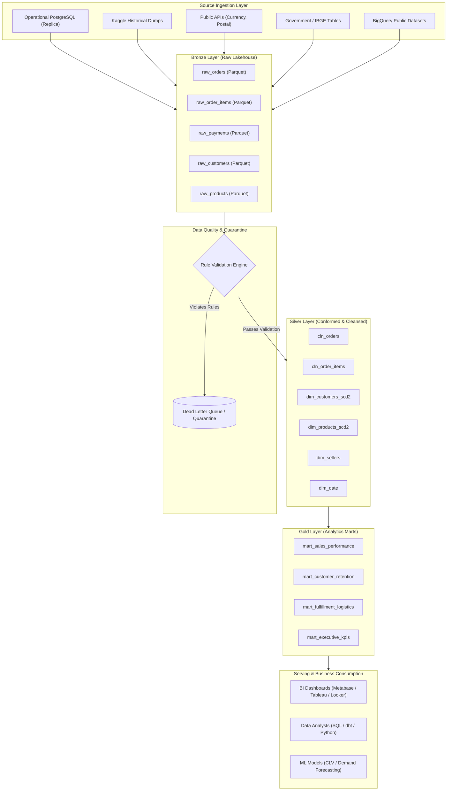

# Enterprise Data Production Pipeline: Architecture & Engineering Specification

> **Target System:** Olist Centralized Analytical Lakehouse / Data Warehouse Platform  
> **Audience:** Data Engineers, Analytics Engineers, Platform Engineers, BI Developers  
> **Document Status:** Active Specification  
> **Data Freshness SLA:** Daily Batch — Verified & Ready by **07:00 AM**

---

## Table of Contents
1. [Executive Summary & Business Context](#1-executive-summary--business-context)
2. [End-to-End Pipeline Engineering Lifecycle](#2-end-to-end-pipeline-engineering-lifecycle)
3. [Source Data Systems & Ingestion Landscape](#3-source-data-systems--ingestion-landscape)
4. [Business Requirements (BR-01 to BR-07)](#4-business-requirements-br-01-to-br-07)
5. [Business Questions Catalog](#5-business-questions-catalog)
6. [KPI & Metrics Dictionary](#6-kpi--metrics-dictionary)
7. [Historical Data Strategy & Dimensional Modeling (SCD Type 2)](#7-historical-data-strategy--dimensional-modeling-scd-type-2)
8. [Data Quality, Validation & Quarantine Framework](#8-data-quality-validation--quarantine-framework)
9. [Operational Constraints & System Safeguards](#9-operational-constraints--system-safeguards)
10. [Data Scale, Throughput & 4-Year Growth Projections](#10-data-scale-throughput--4-year-growth-projections)
11. [Target Architecture & Implementation Blueprint](#11-target-architecture--implementation-blueprint)

---

## 1. Executive Summary & Business Context

### 1.1 Business Problem
Olist’s core transactional and operational data currently resides fragmented across disparate, disconnected source systems (operational RDBMS, third-party APIs, public datasets, government registries, and flat files). 

Because there is no centralized analytical data store:
- Business stakeholders are forced into manual, spreadsheet-driven extracts and joins.
- Cross-functional analytics (e.g., correlating delivery delays with customer retention and seller ratings) are impossible in near-real-time.
- Production systems suffer performance hits due to ad-hoc analytical querying.

### 1.2 Mission & Objective
Build an automated, production-grade, highly reliable, and horizontally scalable analytical data pipeline that consolidates all disparate sources into a single source of truth (SSOT) serving analytical marts for **Sales, Customer, Product, Seller, Operations, Finance, and Executive Management**.

### 1.3 Key Stakeholders & Personas
| Stakeholder Group | Primary Analytics Focus |
| :--- | :--- |
| **Sales** | Revenue trends, top-selling items, category mix, discount leakages |
| **Marketing** | Customer acquisition, cohort retention, LTV, repeat purchase rates |
| **Operations** | Courier delay rates, logistics bottlenecks, warehouse shipping expenses |
| **Finance** | Gross vs. net revenue, payment settlement reconciling, refund/cancellation losses |
| **Management** | Strategic KPIs, executive scorecards, regional expansion performance |
| **Data Analysts & BI** | Ad-hoc SQL exploration, dimensional star schemas, self-serve BI reporting |

---

## 2. End-to-End Pipeline Engineering Lifecycle

The development and deployment of this platform follow a disciplined, requirements-driven engineering workflow:



---

## 3. Source Data Systems & Ingestion Landscape

The pipeline consolidates data across 5 distinct source categories:



| Source System | Content / Domain | Access Mechanism | Extraction Strategy |
| :--- | :--- | :--- | :--- |
| **Operational PostgreSQL** | Orders, order items, payments, customer transactions, seller master | JDBC / Read-replica / WAL CDC | Incremental watermark based on `updated_at` (Off-peak extraction) |
| **Kaggle Datasets** | Historical baseline e-commerce dataset (reviews, orders, legacy customers) | Automated cloud download / S3 bucket sync | One-time bootstrap & historical backfill |
| **BigQuery Public Data** | Geospatial, geographic zip coordinates, regional macroeconomic indicators | BQ Storage Read API / Federated Query | Periodic batch sync (monthly / weekly) |
| **Public API** | Currency exchange rates, logistics tracking status, geocoding validation | REST API with exponential backoff & rate limiting | Daily incremental snapshots |
| **Government Data** | IBGE Brazilian geographic codes, census data, state holiday calendars | HTTP/SFTP batch download | Quarterly / Annual static lookup refresh |

---

## 4. Business Requirements (BR-01 to BR-07)

### BR-01: Centralized Analytical Platform
* **Description:** Eliminate manual siloed data consolidation. Deliver a single, verified analytical lakehouse/warehouse.
* **Engineering Standard:** All downstream consumption (dashboards, dashboards, ML models, operational reports) reads exclusively from conformed Silver/Gold layers. Direct querying of operational transactional databases for analytics is strictly disallowed.

### BR-02: Automated Daily Processing
* **Description:** End-to-end extraction, transformation, quality validation, and publishing must run automatically without human intervention.
* **Engineering Standard:** Orchestrated via DAGs scheduled to trigger off-peak, meeting the **07:00 AM** data readiness SLA. Includes automated alerting (Slack/Email/PagerDuty) on delay or failure.

### BR-03: Incremental Processing
* **Description:** The pipeline must avoid reprocessing unchanged historical records.
* **Engineering Standard:**
  - Watermark tracking using timestamp high-water marks (`updated_at`, `created_at`) or Log-based Change Data Capture (CDC).
  - Target tables updated using idempotent `MERGE` / upsert statements on primary/natural keys.

### BR-04: Historical Attribute Preservation (SCD Type 2)
* **Description:** Preserve state history for mutable entities when business changes matter.
* **Example Use Case:** A customer's state changes from `Maharashtra` to `Karnataka` (or Brazilian states `SP` to `RJ`). Historical sales reports must reflect the customer's state at the exact time the purchase occurred, while current marketing campaigns target their current state.
* **Engineering Standard:** Implement Slowly Changing Dimensions Type 2 (SCD-2) with `valid_from`, `valid_to`, and `is_current` columns on `dim_customers` and `dim_products`.

### BR-05: Comprehensive Data Quality & Quarantine (Dead Letter Queue)
* **Description:** Reject invalid data without silent record loss. Bad records must be isolated, logged, and inspectable.
* **Engineering Standard:**
  - Enforce schema contracts and non-null/range validations before promoting to Silver.
  - Divert failed rows to a dedicated **Quarantine / DLQ (Dead Letter Queue)** table with rejection metadata (`rejection_reason`, `failed_rule`, `ingestion_batch_id`, `raw_payload`, `rejected_at`).

### BR-06: Recoverability & Idempotency
* **Description:** Pipeline failures must be restartable at any intermediate stage without creating duplicates, corrupting state, or requiring manual database cleanup.
* **Engineering Standard:**
  - Every pipeline stage must be strictly **idempotent**.
  - Transformations write to staging/temporary partitions before an atomic commit or merge into target tables.
  - Re-running a batch for date `YYYY-MM-DD` produces identical state.

### BR-07: Auditability & Operational Observability
* **Description:** Full transparency into pipeline execution metrics and data lineage.
* **Engineering Standard:** Maintain an operational metadata log capturing:
  - Pipeline Run ID and Execution Timestamp.
  - Total records received at source.
  - Records successfully processed.
  - Records rejected / quarantined.
  - Execution duration and step-level completion timestamps.
  - Error logs and stack traces if failed.

---

## 5. Business Questions Catalog

The data platform must directly answer the following analytical questions across key operational domains:

```
┌─────────────────────────────────────────────────────────────────────────────────┐
│                               BUSINESS QUESTIONS CATALOG                        │
├──────────────┬──────────────────────────────────────────────────────────────────┤
│ Sales        │ • What is total revenue by day, week, month, and year?           │
│              │ • What are the top-selling products by volume and GMV?           │
│              │ • Which product categories generate the highest revenue?        │
│              │ • What is the overall and segmented Average Order Value (AOV)?   │
│              │ • How much revenue is lost due to customer discounts & vouchers? │
├──────────────┼──────────────────────────────────────────────────────────────────┤
│ Customers    │ • How many new customers are acquired each month?                │
│              │ • Which customer cohorts possess the highest Lifetime Value?     │
│              │ • What is the repeat purchase rate across 30/60/90-day windows?  │
│              │ • How do purchase frequency & order volume differ geographically?│
├──────────────┼──────────────────────────────────────────────────────────────────┤
│ Sellers      │ • Which sellers generate the highest GMV and net revenue?        │
│              │ • Which sellers process the largest order volumes?              │
│              │ • Which sellers have substandard fulfillment & delivery delays? │
├──────────────┼──────────────────────────────────────────────────────────────────┤
│ Operations   │ • What percentage of total customer orders are delivered late?   │
│              │ • Which shipping couriers / 3PL partners have the highest delays?│
│              │ • Which distribution centers / warehouses have highest freight?  │
├──────────────┼──────────────────────────────────────────────────────────────────┤
│ Products     │ • Which products generate the highest cumulative revenue?        │
│              │ • Which products exhibit declining sales velocities?             │
│              │ • How does customer review rating correlate with sales volume?  │
│              │ • Which brands maintain the highest sales and lowest returns?    │
└──────────────┴──────────────────────────────────────────────────────────────────┘
```

---

## 6. KPI & Metrics Dictionary

All metric calculations are standardized across the organization:

| KPI / Metric | Formula / Calculation Logic | Aggregation Grain | Business Purpose |
| :--- | :--- | :--- | :--- |
| **Total (Gross) Revenue** | $\sum (\text{order\_item\_price} + \text{freight\_value})$ | Order Item / Day / Category | Topline GMV tracking |
| **Net Revenue** | $\sum (\text{item\_price}) - \sum (\text{discounts}) - \sum (\text{refunds/returns})$ | Order / Period / Seller | True realized corporate revenue |
| **Total Orders** | $\text{COUNT(DISTINCT } \text{order\_id})$ where order is confirmed | Day / Geo / Channel | Core volume metric |
| **Total Units Sold** | $\sum (\text{quantity})$ | Product / Category / Day | Fulfillment and inventory throughput |
| **Average Order Value (AOV)** | $\frac{\text{Total Gross Revenue}}{\text{Total Orders}}$ | Month / Customer Segment | Customer basket expenditure sizing |
| **Discount Amount** | $\sum (\text{voucher\_value} + \text{coupon\_deduction})$ | Order / Campaign / Seller | Total promotional margin leakage |
| **Customer Count** | $\text{COUNT(DISTINCT } \text{customer\_unique\_id})$ | Geographic Region / Period | Total active buying base |
| **New Customers** | Customers with `first_order_date` within current reporting period | Month / Region | Top-of-funnel customer acquisition |
| **Repeat Customer Rate** | $\frac{\text{Customers with } > 1 \text{ Lifetime Orders}}{\text{Total Distinct Customers}} \times 100$ | Monthly Cohort | Loyalty and retention strength |
| **Customer Lifetime Value** | $\text{AOV} \times \text{Purchase Frequency} \times \text{Average Customer Lifespan}$ | Customer Segment / Cohort | Long-term customer equity |
| **Seller Revenue** | $\sum (\text{item\_price})$ grouped by `seller_id` | Seller / Month | Seller GMV contribution ranking |
| **Seller Order Count** | $\text{COUNT(DISTINCT } \text{order\_id})$ grouped by `seller_id` | Seller / Month | Operational seller capacity |
| **Cancellation Rate** | $\frac{\text{Orders with status 'canceled'}}{\text{Total Orders Placed}} \times 100$ | Day / Fulfillment Method | Order drop-off & inventory leakage |
| **Return Rate** | $\frac{\text{Orders returned / refunded}}{\text{Total Delivered Orders}} \times 100$ | Product / Category / Seller | Product quality & dissatisfaction |
| **On-Time Delivery Rate** | $\frac{\text{Orders where } \text{delivered\_date} \le \text{estimated\_delivery\_date}}{\text{Total Delivered Orders}} \times 100$ | Courier / Region / Month | Logistics SLA compliance |
| **Average Delivery Time** | $\text{AVG}(\text{delivered\_customer\_date} - \text{order\_purchase\_date})$ in days | Carrier / Route / Month | Customer fulfillment speed |
| **Average Shipping Cost** | $\frac{\sum \text{freight\_value}}{\text{Total Orders}}$ | Origin Warehouse / State | Logistics expense benchmarking |
| **Product Revenue** | $\sum (\text{quantity} \times \text{unit\_price})$ grouped by `product_id` | Product / Month | SKU profitability & prioritization |
| **Product Rating** | $\text{AVG}(\text{review\_score})$ on 1 to 5 scale | SKU / Brand / Category | Customer satisfaction & quality score |

---

## 7. Historical Data Strategy & Dimensional Modeling (SCD Type 2)

### 7.1 Historical Preservation Requirements
Business changes occur dynamically in operational systems:
1. **Customers:** Change billing address, state, postal code, phone number, and tier.
2. **Products:** Categories, subcategories, brand designations, and list prices evolve.
3. **Orders:** Progress through transactional states: `created` $\rightarrow$ `approved` $\rightarrow$ `shipped` $\rightarrow$ `delivered` (or `canceled`).

To ensure accurate historical financial and regional attribution, dimensions undergo **Slowly Changing Dimension Type 2 (SCD-2)** modeling.

### 7.2 SCD-2 Implementation Schema Pattern

```
┌────────────────────────────────────────────────────────────────────────────────────────────────────────────────┐
│                                            dim_customers (SCD-2)                                               │
├───────────────────┬──────────────┬──────────────┬──────────────┬────────────┬────────────┬───────────┬─────────┤
│ customer_sk (PK)  │ customer_id  │ state        │ city         │ valid_from │ valid_to   │ is_current│ hash_val│
├───────────────────┼──────────────┼──────────────┼──────────────┼────────────┼────────────┼───────────┼─────────┤
│ 1001              │ CUST-9821    │ Maharashtra  │ Mumbai       │ 2024-01-01 │ 2025-06-15 │ FALSE     │ 7a8f... │
│ 1098              │ CUST-9821    │ Karnataka    │ Bengaluru    │ 2025-06-15 │ 9999-12-31 │ TRUE      │ 9c4b... │
└───────────────────┴──────────────┴──────────────┴──────────────┴────────────┴────────────┴───────────┴─────────┘
```

#### Technical Attributes for SCD Type 2 Tables:
- `surrogate_key` (BIGINT / UUID): Synthetic unique identifier joining fact tables to the exact historical dimension version.
- `natural_key` (`customer_id`, `product_id`): Business identifier from source system.
- `valid_from` (TIMESTAMP): Ingestion timestamp when this attribute revision became active.
- `valid_to` (TIMESTAMP): Ingestion timestamp when superseded (set to `9999-12-31` or `NULL` for current record).
- `is_current` (BOOLEAN): Flag (`TRUE`/`FALSE`) for instantaneous current-state lookups.
- `row_hash` (CHAR(64)): SHA-256 hash of tracked attributes to detect changes efficiently without column-by-column string comparison.

### 7.3 Dimensional Star Schema Architecture



---

## 8. Data Quality, Validation & Quarantine Framework

### 8.1 Automated Data Quality Rules Matrix

The pipeline enforces data validation contracts before any records enter the conformed Silver layer:

| Check Category | Target Field | Validation Constraint Rule | Severity | Pipeline Action |
| :--- | :--- | :--- | :--- | :--- |
| **Completeness** | `customer_id` | `IS NOT NULL AND length(trim(customer_id)) > 0` | Critical | Reject row $\rightarrow$ Quarantine |
| **Completeness** | `product_id` | `IS NOT NULL AND length(trim(product_id)) > 0` | Critical | Reject row $\rightarrow$ Quarantine |
| **Completeness** | `order_id` | `IS NOT NULL AND length(trim(order_id)) > 0` | Critical | Reject row $\rightarrow$ Quarantine |
| **Uniqueness** | Primary Keys | `COUNT(*) == 1` per natural PK set | Critical | Reject duplicates $\rightarrow$ Quarantine |
| **Value Domain** | `quantity` | `quantity > 0` | High | Reject row $\rightarrow$ Quarantine |
| **Value Domain** | `unit_price` | `unit_price >= 0.00` | High | Reject row $\rightarrow$ Quarantine |
| **Value Domain** | `discount` | `discount >= 0.00 AND discount <= unit_price * quantity` | High | Reject row $\rightarrow$ Quarantine |
| **Value Domain** | `payment_amount` | `payment_amount >= 0.00` | High | Reject row $\rightarrow$ Quarantine |
| **Chronology** | `delivered_date` | `delivered_date >= order_date` | High | Flag anomaly $\rightarrow$ Quarantine |
| **Chronology** | `shipped_date` | `shipped_date >= order_date` | High | Flag anomaly $\rightarrow$ Quarantine |
| **Referential** | Foreign Keys | FK must exist in parent dimension / upstream staging | Medium | Assign `UNKNOWN` dummy SK (SK = -1) & Alert |

### 8.2 Quarantine (Dead Letter Queue) Pattern



#### Quarantine Table Structure (`audit_quarantine_records`):
- `quarantine_id`: Unique tracking ID.
- `source_system`: Source database or API.
- `source_table`: Entity name (e.g., `orders`, `order_items`).
- `raw_payload`: Full JSON representation of the rejected record.
- `failed_rule_code`: Identifier for violated check (e.g., `ERR_VAL_NEGATIVE_PRICE`).
- `error_message`: Human-readable failure explanation.
- `ingestion_batch_id`: Pipeline run identifier.
- `created_at`: Timestamp of rejection.

---

## 9. Operational Constraints & System Safeguards

### Constraint 1: Production PostgreSQL Protection
* **Problem:** The operational database powers live customer checkout and order processing. Heavy analytical table scans during business hours will cause connection pool exhaustion, CPU spikes, and transactional lock contention.
* **Engineering Mandate:**
  1. **Zero analytical queries** executed against operational PostgreSQL.
  2. Extract data via **dedicated Read Replicas** or read directly from PostgreSQL WAL logs via CDC (e.g., Debezium).
  3. Batch extraction jobs must run during the strict off-peak maintenance window (**01:00 AM – 04:00 AM**).
  4. Query chunking: Ingest incremental updates using bounded watermark windows (`WHERE updated_at >= :last_sync AND updated_at < :current_sync`) with indexed key pagination.

### Constraint 2: Zero Modification to Source Systems
* **Problem:** Data engineering cannot alter source schemas, add custom indexes, write stored procedures, or install transactional database triggers.
* **Engineering Mandate:** The ingestion layer is completely read-only and non-invasive. All transformations, schema standardizations, surrogate key generation, and hash calculations are executed within the downstream lakehouse/warehouse compute engine.

### Constraint 3: Strict Idempotency & Re-runnability
* **Problem:** Unhandled exceptions, infrastructure drops, or transient network timeouts mid-pipeline must not result in duplicate records, half-populated tables, or corrupted aggregates.
* **Engineering Mandate:**
  1. Staged writes: Load data into deterministic partition targets or temporary tables.
  2. Use atomic `MERGE` / upsert transactions based on natural keys.
  3. Re-executing an extraction or transformation DAG for date `T` cleanly replaces or reconciles partition `T`.

### Constraint 4: Dual Support for Historical Backfill and Daily Incrementals
* **Problem:** The system must process years of historical Kaggle/legacy dumps while maintaining standard daily batch runs.
* **Engineering Mandate:** Build unified transformation logic that operates identically in:
  - **Backfill Mode:** High-throughput partition-parallel historical ingest with disabled foreign key lookups and batch bulk-loading.
  - **Incremental Mode:** Watermark-driven daily delta ingestion with active SCD-2 change detection.

---

## 10. Data Scale, Throughput & 4-Year Growth Projections

The architecture is deliberately designed to handle substantial enterprise scale rather than in-memory laptop processing.

### 10.1 Daily Record Volume Profile

```
┌──────────────────────────────┬────────────────────────────┐
│ Entity / Stream              │ Daily Record Ingestion Rate│
├──────────────────────────────┼────────────────────────────┤
│ Orders                       │ 100,000 / day              │
│ Order Items                  │ 250,000 / day              │
│ Payments                     │ 120,000 / day              │
│ Customers (Active / Updates) │  20,000 / day              │
│ Product Updates              │  10,000 / day              │
│ Shipments & Status Events    │  90,000 / day              │
├──────────────────────────────┼────────────────────────────┤
│ Total Daily Ingestion Volume │ 590,000 records / day      │
└──────────────────────────────┴────────────────────────────┘
```

### 10.2 Four-Year Volume & Scalability Scaling Curve

| Horizon | Scale Factor | Daily Orders | Daily Items | Annual Transaction Rows | Est. Uncompressed Raw / Year | Est. Compressed Parquet / Year |
| :--- | :--- | :--- | :--- | :--- | :--- | :--- |
| **Year 1 (Current)** | **$1\times$** | 100,000 | 250,000 | $\approx 215 \text{ Million}$ | $\approx 100\text{ GB}$ | $\approx 20\text{ GB}$ |
| **Year 2** | **$2\times$** | 200,000 | 500,000 | $\approx 430 \text{ Million}$ | $\approx 200\text{ GB}$ | $\approx 40\text{ GB}$ |
| **Year 3** | **$4\times$** | 400,000 | 1,000,000 | $\approx 860 \text{ Million}$ | $\approx 400\text{ GB}$ | $\approx 80\text{ GB}$ |
| **Year 4** | **$8\times$** | 800,000 | 2,000,000 | $\approx 1.72 \text{ Billion}$ | $\approx 800\text{ GB}$ | $\approx 160\text{ GB}$ |

### 10.3 Engineering Implications for Growth
- **Laptop-Scale Anti-Pattern:** Loading raw datasets into local Pandas DataFrames will fail within months due to memory limits (OOM).
- **Architecture Mandate:** 
  - Columnar, compressed, partitioned storage (Snappy-compressed Apache Parquet / Delta Lake / Apache Iceberg).
  - Distributed or chunked out-of-core compute engine (e.g., Apache Spark, DuckDB / Polars with batch chunking, or cloud data warehouses like BigQuery/Snowflake).
  - Partitioning strategy: Partition raw and fact tables by `order_date (YYYY-MM)`. Cluster by `customer_id` and `product_id`.

---

## 11. Target Architecture & Implementation Blueprint

### 11.1 Medallion Architecture Model



### 11.2 Daily Execution & SLA Schedule Window

```
00:00 AM                  02:00 AM                  04:30 AM                  06:15 AM         07:00 AM (SLA Target)
   │                         │                         │                         │                    │
   ▼                         ▼                         ▼                         ▼                    ▼
┌─────────────────────────┐┌─────────────────────────┐┌─────────────────────────┐┌──────────────────┐┌────────────────┐
│  Stage 1: Source Extract││ Stage 2: Ingest Bronze  ││ Stage 3: Silver Cleansing││  Stage 4: Gold   ││ Data Available │
│  Read-Replica Off-Peak  ││ Raw Parquet Storage     ││ DQ Checks & SCD2 Merge   ││  Marts Published ││ to Business    │
│  Incremental Watermarks ││ Metadata Audit Logged   ││ Quarantine Invalid Rows  ││  Integrity Tests ││ Stakeholders   │
└─────────────────────────┘└─────────────────────────┘└─────────────────────────┘└──────────────────┘└────────────────┘
```

### 11.3 Recommended Production Technology Stack

| Layer / Capability | Recommended Technology | Rationale |
| :--- | :--- | :--- |
| **Workflow Orchestration** | Apache Airflow / Dagster | DAG-based task dependency scheduling, SLA tracking, retries, audit metadata |
| **Data Extraction** | Python (psycopg2 / SQLModel / DuckDB) | High-performance extraction, streaming iterators to prevent memory overload |
| **Storage & Lakehouse** | Apache Parquet / Iceberg on Cloud Storage (S3 / GCS / Azure Blob) | Columnar compression, partition pruning, time-travel capabilities |
| **Data Quality Validation** | Great Expectations / Soda Core / Custom Python Assertions | Automated assertion enforcement and quarantine routing |
| **Data Transformation** | dbt (data build tool) / Polars / Apache Spark | Idempotent incremental modeling, native SCD Type 2 snapshots, lineage |
| **Serving Warehouse** | PostgreSQL Analytics Mart / DuckDB / BigQuery / Snowflake | High-performance SQL queries for BI layers |
| **Monitoring & Alerting** | OpenLineage + Prometheus/Grafana or Slack Webhooks | Real-time SLA breach alerting, record throughput monitoring |

---

## 12. Verification & Acceptance Criteria

Before declaring any pipeline phase production-ready, developers must verify:
1. **Zero Data Loss:** $\text{Received Count} = \text{Processed Count} + \text{Quarantined Count}$.
2. **SCD-2 Consistency:** No overlapping active intervals (`valid_from` to `valid_to`) for identical natural keys in dimensional tables.
3. **Idempotency Proof:** Triggering the same daily run twice in succession results in zero duplicate rows in Silver/Gold layers.
4. **SLA Adherence:** Full run completes before 07:00 AM under $1\times$ and projected $2\times$ volumes.
5. **No Production Load:** Read queries against operational PostgreSQL never exceed read-replica resource thresholds and run solely within off-peak hours.
