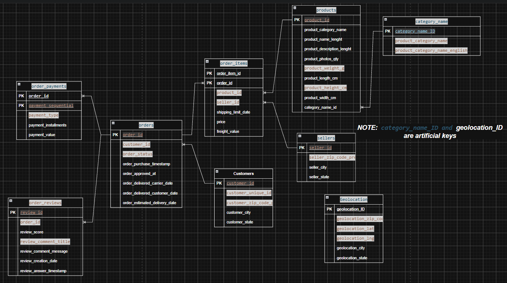

# 02. Data Sources & Ingestion Strategy

> **Focus:** Source inventory, access protocols, extraction strategies, and source constraints.

---

## 1. Source Systems Inventory & Strategy

> **Decision Note (per DECISION.md):** The pipeline currently ingests and processes **exclusively the Kaggle Dataset** for initial inspection, business decisions, and dimensional data modeling. Integration of additional external or operational sources is deferred to future project iterations.

### 1.1 Active Primary Source: Kaggle E-Commerce Dataset

All active ingestion pipelines extract from the baseline Brazilian E-Commerce dataset (located in `Kaggle_dataset/`):

| File / Dataset | Entity Domain | Ingestion Frequency | Ingestion Mechanism | Target Layer |
| :--- | :--- | :--- | :--- | :--- |
| `olist_orders_dataset.csv` | Order headers & milestone timestamps | Batch baseline / periodic backfill | CSV / Lakehouse Ingestion | Raw / Bronze Parquet |
| `olist_order_items_dataset.csv` | Item SKUs, prices, freight charges | Batch baseline / periodic backfill | CSV / Lakehouse Ingestion | Raw / Bronze Parquet |
| `olist_order_payments_dataset.csv` | Payment types, installments, sequence | Batch baseline / periodic backfill | CSV / Lakehouse Ingestion | Raw / Bronze Parquet |
| `olist_order_reviews_dataset.csv` | Customer ratings, reviews, response times | Batch baseline / periodic backfill | CSV / Lakehouse Ingestion | Raw / Bronze Parquet |
| `olist_customers_dataset.csv` | Customer ID, Unique ID, city, state, zip | Batch baseline / periodic backfill | CSV / Lakehouse Ingestion | Raw / Bronze Parquet |
| `olist_products_dataset.csv` | Product dimensions, categories, photos | Batch baseline / periodic backfill | CSV / Lakehouse Ingestion | Raw / Bronze Parquet |
| `olist_sellers_dataset.csv` | Seller ID, city, state, zip code | Batch baseline / periodic backfill | CSV / Lakehouse Ingestion | Raw / Bronze Parquet |
| `olist_geolocation_dataset.csv` | Zip prefixes, coordinates, city, state | Static reference | CSV / Lakehouse Ingestion | Raw / Bronze Parquet |
| `product_category_name_translation.csv` | Category translation (PT -> EN) | Static lookup | CSV / Lakehouse Ingestion | Raw / Bronze Parquet |

### 1.2 Kaggle Source Relational Data Model

Below is the source relational schema and entity relationships for the Kaggle dataset:



*Note: `category_name_id` and `geolocation_id` serve as synthetic surrogate reference keys where natural IDs were absent in source files.*

---

### 1.3 Deferred / Future Data Sources

The following sources were identified during system design but are **on hold**. Decisions regarding their integration will be evaluated in subsequent roadmap phases:

| Source System | Data Domain | Planned Mechanism | Status |
| :--- | :--- | :--- | :--- |
| **Operational PostgreSQL** | Live order checkout & seller profiles | Read-Replica JDBC / WAL CDC | Deferred (post-MVP) |
| **BigQuery Public Data** | Geospatial reference tables & postal coords | BQ Storage Read API | Deferred (post-MVP) |
| **Public REST APIs** | Currency exchange rates, logistics tracking | Rate-limited HTTP client | Deferred (post-MVP) |
| **Government Data (IBGE)** | Brazilian census, municipal codes, holiday calendars | Scheduled HTTP / SFTP fetch | Deferred (post-MVP) |

---

## 2. Source-Side Constraints & Safeguards

These two operational constraints are non-negotiable:

### Constraint 1: Operational PostgreSQL Database Protection
- **The Issue:** The operational database is a live production OLTP system processing customer checkout orders. Heavy analytical queries or full-table scans during business hours will exhaust connection pools and lock transactional rows.
- **Rules:**
  1. **Zero analytical queries** against the operational primary database.
  2. Ingestion queries must connect exclusively to a **dedicated Read Replica** or read transactional logs via **Change Data Capture (CDC)**.
  3. Batch extraction jobs must run strictly during the **off-peak window (01:00 AM – 04:00 AM)**.
  4. Extractions must use indexed watermark queries (`WHERE updated_at >= :last_sync AND updated_at < :current_sync`) with cursor pagination.

### Constraint 2: Source Systems Cannot Be Modified
- **The Issue:** Data engineers do not have administrative access to alter production source schemas.
- **Rules:**
  1. You **cannot** add indexes, columns, triggers, or stored procedures to source databases.
  2. The ingestion client must be strictly read-only (`SELECT` permissions only).
  3. All data cleansing, deduplication, surrogate key generation, and transformations occur downstream in the Lakehouse / Data Warehouse compute layer.

---

## 3. Raw Landing Zone Architecture (AWS S3)

Extracted data is stored immutably in an AWS S3 landing bucket before any transformations take place:

```text
s3://<project-lakehouse-bucket>/
├── raw/
│   ├── orders/
│   │   └── ingestion_date=YYYY-MM-DD/
│   │       ├── orders_part_001.parquet
│   │       └── _metadata.json
│   ├── order_items/
│   │   └── ingestion_date=YYYY-MM-DD/
│   ├── payments/
│   │   └── ingestion_date=YYYY-MM-DD/
│   ├── customers/
│   │   └── ingestion_date=YYYY-MM-DD/
│   ├── products/
│   │   └── ingestion_date=YYYY-MM-DD/
│   └── external_api/
│       └── rate_date=YYYY-MM-DD/
└── archive/
```

### Ingestion Metadata Captured Per File:
- `_ingestion_timestamp`: UTC timestamp when extraction was written.
- `_source_system`: Name of the originating system (e.g., `postgres_replica`, `api_rates`).
- `_batch_id`: Unique Airflow DAG execution run identifier.
- `_record_count`: Number of records written in this partition.
