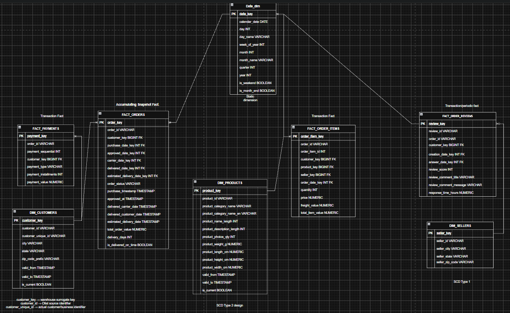
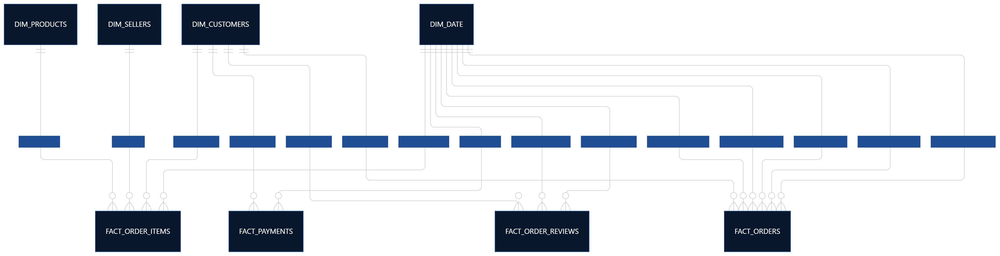
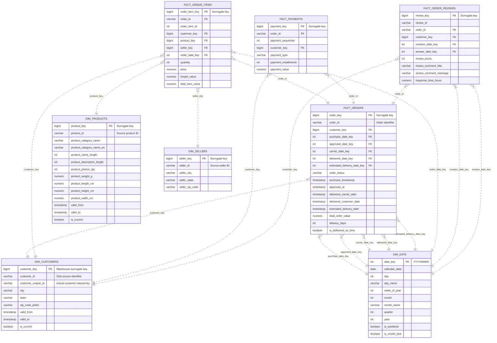

# 03. Dimensional Data Modeling & SCD Strategy

> **Focus:** Star schema design, fact table grains, surrogate keys, and Slowly Changing Dimensions (SCD Type 2).

---

## 1. Dimensional Architecture Overview

To support high-performance analytical queries and self-serve business intelligence, the target data warehouse layer implements a **Dimensional Star Schema** centered around business events and order fulfillment lifecycles.

### 1.1 Dimensional Data Model Diagram

The comprehensive star schema architecture defines 4 fact tables and 4 dimension tables:

### 1.2 Enterprise Bus Architecture Matrix

The dimensional bus structure links conforming dimensions across core transactional and snapshot business processes:

---

## 2. Star Schema Entity-Relationship Model

---

## 3. Table Grains & Architectural Roles

Per the design formalized in `DECISION.md`, table types and grains are defined as follows:

| Table | Type | Grain | Business Purpose |
| :--- | :--- | :--- | :--- |
| **`FACT_ORDERS`** | **Accumulating Snapshot** | 1 row per order | Tracks order progression through fulfillment lifecycle milestones (purchase, approval, carrier handoff, customer delivery, estimated delivery), duration metrics (`delivery_days`), and SLA compliance (`is_delivered_on_time`). |
| **`FACT_ORDER_ITEMS`** | **Transaction** | 1 row per order item | Line-item level commercial transactions, unit prices, shipping fees (`freight_value`), and product-level sales margin analysis. |
| **`FACT_PAYMENTS`** | **Transaction** | 1 row per payment sequence | Records every payment attempt, split payment method (credit card, voucher, boleto), installment details, and cash reconciliation. |
| **`FACT_ORDER_REVIEWS`** | **Transaction** | 1 row per review | Captures customer satisfaction feedback, review scores (1–5), survey comments, and response latency (`response_time_hours`). |
| **`DIM_CUSTOMERS`** | **SCD Type 2** | 1 row per customer version | Preserves demographic and geographic relocation history across customer versions. |
| **`DIM_PRODUCTS`** | **SCD Type 2 design** | 1 row per product version | Tracks product specification evolutions, physical dimensions, and translated category taxonomies. |
| **`DIM_SELLERS`** | **SCD Type 1** | 1 row per seller | Maintains up-to-date merchant information, origin cities, and operating states. |
| **`DIM_DATE`** | **Static** | 1 row per calendar date | Conformed enterprise date dimension enabling time-series rollups, seasonal trend analysis, weekend, and month-end indicators. |

---

## 4. Slowly Changing Dimensions (SCD) Strategy

Business entities naturally evolve over time. Ensuring historical analytical integrity requires clear SCD tiering:

### 4.1 Customer Dimension (`DIM_CUSTOMERS`) — SCD Type 2

Customer profiles track geographical movements without overwriting historical order contexts:

* **Key Distinctions:**
  * `customer_key`: Synthetic warehouse surrogate key (PK).
  * `customer_id`: Olist source identifier associated with an order transaction.
  * `customer_unique_id`: Actual unique business entity identifier representing the person.
* **Standard SCD-2 Metadata Attributes:**
  * `valid_from`: Timestamp when the address/profile version became effective.
  * `valid_to`: Timestamp when superseded (`9999-12-31 23:59:59` for current active record).
  * `is_current`: Boolean flag (`TRUE` for active, `FALSE` for historical).
  * `row_hash`: SHA-256 fingerprint of tracked attributes (`city`, `state`, `zip_code_prefix`) to determine change delta.

### 4.2 Product Dimension (`DIM_PRODUCTS`) — SCD Type 2 Design

* Supports versioning when product dimensions, weight, or category categorizations (Portuguese and English translations) are modified over time.
* Ensures historical margin and weight-based logistics analyses reflect the attributes effective at the time of purchase.

### 4.3 Seller Dimension (`DIM_SELLERS`) — SCD Type 1

* Seller relocations or operational zip code changes overwrite in-place (SCD-1) under the current operational assumptions, keeping reporting aligned with active seller headquarters.

---

## 5. Accumulating Snapshot Fact Table (`FACT_ORDERS`)

Unlike transaction facts that represent instantaneous events, `FACT_ORDERS` models the multi-stage lifecycle of an order:

1. **Order Placed** &rarr; `purchase_date_key`, `purchase_timestamp`
2. **Payment Approved** &rarr; `approved_date_key`, `approved_at`
3. **Carrier Hand-off** &rarr; `carrier_date_key`, `delivered_carrier_date`
4. **Delivered to Customer** &rarr; `delivered_date_key`, `delivered_customer_date`
5. **Promised SLA Date** &rarr; `estimated_delivery_date_key`, `estimated_delivery_date`

As the order progresses through each milestone, the accumulating snapshot record is updated with timestamp and date key foreign keys, enabling rapid calculation of end-to-end cycle times and fulfillment latency.

---

## 6. Physical Warehouse Architecture & Schemas (`ecommerce_dwh`)

The dimensional model is implemented within the **`ecommerce_dwh`** database following a two-tier ELT schema architecture:

* **`staging` Schema:** Source-aligned, type-cast, and cleaned tables representing the Kaggle datasets (`stg_customers`, `stg_orders`, `stg_order_items`, `stg_order_payments`, `stg_order_reviews`, `stg_products`, `stg_sellers`).
* **`dwh` Schema:** Serving layer hosting the 4 Kimball dimensions (`dim_customers`, `dim_products`, `dim_sellers`, `dim_date`) and 4 facts (`fact_orders`, `fact_order_items`, `fact_payments`, `fact_order_reviews`).

> For full physical DDL scripts, constraints, indexing strategies, and lineage flows, refer to [08. Data Warehouse Architecture & Physical Design](08_DWH_DESIGN.md).
