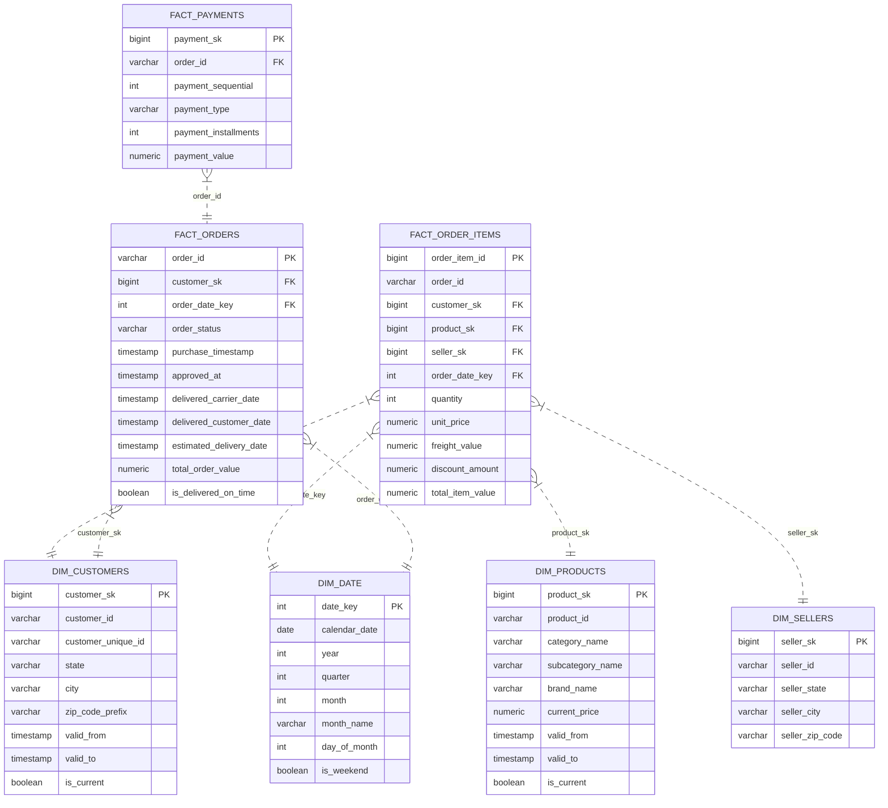

# 03. Dimensional Data Modeling & SCD Strategy

> **Focus:** Star schema design, fact table grains, surrogate keys, and Slowly Changing Dimensions (SCD Type 2).

---

## 1. Dimensional Star Schema Architecture

To support high-performance analytical queries and self-serve business intelligence, the target layer follows a dimensional **Star Schema** centered around business events:



---

## 2. Table Grains & Key Definitions

| Table | Type | Grain | Business Purpose |
| :--- | :--- | :--- | :--- |
| `fact_order_items` | Accumulating Fact | 1 row per individual SKU item within an order | Core sales, margin, revenue, and product item analysis |
| `fact_orders` | Transaction Fact | 1 row per order header | Order lifecycle, fulfillment, on-time delivery metrics |
| `fact_payments` | Transaction Fact | 1 row per payment transaction attempt/installment | Payment method mix, installment trends, cash reconciliation |
| `dim_customers` | Dimension (SCD-2) | 1 row per version of a customer profile | Customer demographics, geographic segmentation |
| `dim_products` | Dimension (SCD-2) | 1 row per version of a product SKU | Product catalog hierarchy, category revenue tracking |
| `dim_sellers` | Dimension (SCD-1) | 1 row per seller | Seller location and partner analysis |
| `dim_date` | Dimension (Static) | 1 row per calendar date | Date rollups, calendar quarters, fiscal year aggregations |

---

## 3. Slowly Changing Dimensions (SCD Type 2)

Business attributes change over time. Overwriting customer addresses or product prices destroys historical reporting accuracy.

### 3.1 SCD-2 Standard Attributes

Every SCD Type 2 dimension table includes these technical metadata fields:

| Field Name | Data Type | Description |
| :--- | :--- | :--- |
| `surrogate_key` | `BIGINT` | Synthetic unique primary key generated by the pipeline. |
| `natural_key` | `VARCHAR` | Business ID from the source system (e.g., `customer_id`, `product_id`). |
| `valid_from` | `TIMESTAMP` | Date/time when this attribute revision became active. |
| `valid_to` | `TIMESTAMP` | Date/time when superseded (`9999-12-31 23:59:59` for active records). |
| `is_current` | `BOOLEAN` | `TRUE` if currently active, `FALSE` if historical. |
| `row_hash` | `CHAR(64)` | SHA-256 hash of tracked attributes to detect changes rapidly without column-by-column diffs. |

### 3.2 Concrete Example: Customer Relocation
A customer (`CUST-9821`) relocates from **Maharashtra** to **Karnataka**:

```text
dim_customers:
┌─────────────┬─────────────┬─────────────┬────────────┬─────────────────────┬─────────────────────┬────────────┐
│ customer_sk │ customer_id │ state       │ city       │ valid_from          │ valid_to            │ is_current │
├─────────────┼─────────────┼─────────────┼────────────┼─────────────────────┼─────────────────────┼────────────┤
│ 1001        │ CUST-9821   │ Maharashtra │ Mumbai     │ 2024-01-01 00:00:00 │ 2025-06-15 11:30:00 │ FALSE      │
│ 1098        │ CUST-9821   │ Karnataka   │ Bengaluru  │ 2025-06-15 11:30:00 │ 9999-12-31 23:59:59 │ TRUE       │
└─────────────┴─────────────┴─────────────┴────────────┴─────────────────────┴─────────────────────┴────────────┘
```

#### Analytical Impact:
- **Historical Reporting (2024 Sales):** When querying orders placed in 2024, `fact_order_items` joins on `customer_sk = 1001`. The revenue is correctly credited to **Maharashtra**.
- **Current Marketing Campaigns (Today):** Marketing targets users where `is_current = TRUE`. The campaign correctly addresses the customer in **Karnataka**.

### 3.3 Product SCD-2 Tracking
Changes to product attributes (e.g., Category, Subcategory, Brand, and List Price) generate a new version in `dim_products`. Sales made prior to a category re-classification remain tied to the historical category.
