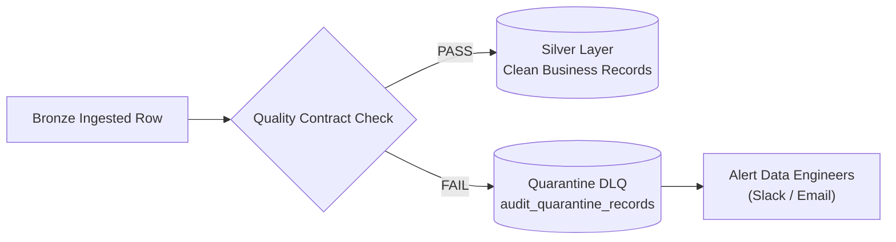

# 05. Data Quality, Governance & Observability

> **Focus:** Data contract validations, quarantine (DLQ) architecture, idempotency, failure recovery, and pipeline auditing.

---

## 1. Automated Data Quality Rules Matrix

Data entering the pipeline must pass strict automated validation checks before being promoted from the Bronze layer to the conformed Silver layer:

| Check Category | Target Column | Validation Constraint Rule | Severity | Action on Failure |
| :--- | :--- | :--- | :--- | :--- |
| **Completeness** | `customer_id` | `IS NOT NULL AND length(trim(customer_id)) > 0` | Critical | Divert row $\rightarrow$ Quarantine |
| **Completeness** | `product_id` | `IS NOT NULL AND length(trim(product_id)) > 0` | Critical | Divert row $\rightarrow$ Quarantine |
| **Completeness** | `order_id` | `IS NOT NULL AND length(trim(order_id)) > 0` | Critical | Divert row $\rightarrow$ Quarantine |
| **Uniqueness** | Natural Keys | Primary key combinations must be strictly unique | Critical | Deduplicate by highest `updated_at` |
| **Value Domain** | `quantity` | `quantity > 0` | High | Divert row $\rightarrow$ Quarantine |
| **Value Domain** | `unit_price` | `unit_price >= 0.00` | High | Divert row $\rightarrow$ Quarantine |
| **Value Domain** | `discount` | `discount >= 0.00 AND discount <= (unit_price * quantity)` | High | Divert row $\rightarrow$ Quarantine |
| **Value Domain** | `payment_amount` | `payment_amount >= 0.00` | High | Divert row $\rightarrow$ Quarantine |
| **Chronology** | `delivered_date` | `delivered_date >= order_purchase_date` | High | Divert row $\rightarrow$ Quarantine |
| **Chronology** | `shipped_date` | `shipped_date >= order_purchase_date` | High | Divert row $\rightarrow$ Quarantine |
| **Referential** | Foreign Keys | FK exists in upstream dimension/staging table | Medium | Assign `UNKNOWN` SK (`-1`) & Alert |

---

## 2. Quarantine / Dead Letter Queue (DLQ) Pattern

> **Non-Negotiable Requirement (BR-05):** Bad records must **never silently disappear**.

When a record fails any critical or high-severity rule, the validation engine routes it to the `audit_quarantine_records` table:



### Quarantine Table Schema:
```sql
CREATE TABLE audit_quarantine_records (
    quarantine_id       UUID PRIMARY KEY,
    source_system       VARCHAR(50),
    source_table        VARCHAR(100),
    raw_payload         TEXT,                -- Full JSON representation of the rejected record
    failed_rule_code    VARCHAR(50),         -- e.g., ERR_NEGATIVE_PRICE, ERR_NULL_ORDER_ID
    error_message       TEXT,
    ingestion_batch_id  VARCHAR(100),        -- Airflow run ID
    created_at          TIMESTAMP DEFAULT CURRENT_TIMESTAMP
);
```

---

## 3. Idempotency & Safe Re-runnability

> **Constraint 3:** The pipeline must be rerunnable. Re-running the same pipeline with identical inputs must produce the identical target state.

```text
Run 1 (Initial Batch) ──▶ Extracted & Processed 1,000 records  (Target Table = 1,000)
Run 2 (Manual Retry)  ──▶ Re-processed 1,000 records           (Target Table = 1,000)  ✅ IDEMPOTENT
                                                               (Target Table = 2,000)  ❌ CORRUPT!
```

### Technical Implementation:
1. **Partition Overwrites:** Stage incremental partitions in deterministic paths (`ingestion_date=YYYY-MM-DD`).
2. **Atomic MERGE / Upsert:** Downstream tables update matching rows and insert new ones based on natural business keys:
   ```sql
   MERGE INTO silver_orders AS target
   USING staged_orders AS source
   ON target.order_id = source.order_id
   WHEN MATCHED AND source.updated_at > target.updated_at THEN
     UPDATE SET *
   WHEN NOT MATCHED THEN
     INSERT *;
   ```

---

## 4. Failure Recovery & Resiliency

Pipelines inevitably face network blips, API rate limits, or transient schema changes:

```
Task 1: S3 Ingestion     ──▶ [ SUCCESS ✅ ]
Task 2: Bronze Delta     ──▶ [ SUCCESS ✅ ]
Task 3: Silver Conformance ──▶ [ FAILED  ❌ ]
Task 4: Gold Marts       ──▶ [ SKIPPED ⏸️ ]
```

### Recovery Principles:
- **Clean Resumption:** Retrying the failed DAG from Task 3 must succeed without manual cleanup, rollbacks, or duplicate entries in Bronze.
- **ACID Transactions:** Delta Lake and staging tables isolate unfinished transactions from downstream analytical queries.

---

## 5. Auditability & Observability (BR-07)

Every pipeline execution records end-to-end operational metadata:

```sql
CREATE TABLE audit_pipeline_execution_log (
    run_id              VARCHAR(100) PRIMARY KEY,
    dag_id              VARCHAR(100),
    execution_start     TIMESTAMP,
    execution_end       TIMESTAMP,
    records_received    INT,
    records_processed   INT,
    records_quarantined INT,
    status              VARCHAR(20),       -- SUCCESS, FAILED, RETRY
    error_details       TEXT
);
```

### Operational Check:
$$\text{Records Received} = \text{Records Processed} + \text{Records Quarantined}$$
If this equation does not balance, the pipeline execution flags an immediate audit discrepancy.