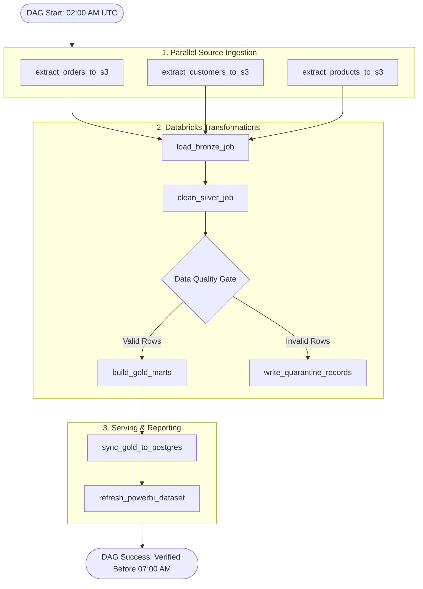

# 06. System Architecture & Implementation Roadmap

> **Focus:** High-level platform architecture, 10-phase engineering roadmap, Airflow DAG orchestration, and repository layout.

---

## 1. High-Level System Architecture

The analytical pipeline follows a decoupled **Lakehouse-to-Warehouse (Medallion)** architecture:

```mermaid
flowchart TD
    subgraph Sources ["1. Source Ingestion Layer"]
        PG["Operational PostgreSQL (Replica)"]
        API["Public REST APIs"]
        KAG["Kaggle Baseline Files"]
        BQ["BigQuery Public Data"]
        GOV["Government (IBGE) Data"]
    end

    subgraph Landing ["2. Raw Landing (AWS S3)"]
        S3[("s3://project-bucket/raw/")]
    end

    subgraph Orchestrator ["3. Workflow Orchestrator"]
        AIRFLOW["Apache Airflow (Daily 02:00 AM DAG)"]
    end

    subgraph Lakehouse ["4. Databricks Compute (Medallion Architecture)"]
        BRONZE[("Bronze Delta<br/>Raw Source-Preserved")]
        SILVER[("Silver Delta<br/>Cleansed, Validated & SCD-2")]
        GOLD[("Gold Delta<br/>Dimensional Star Schema & Marts")]
        DLQ[("Quarantine DLQ<br/>Invalid Records")]
    end

    subgraph Serving ["5. Serving & Business Layer"]
        SERV_PG[("PostgreSQL Analytics DWH<br/>High-Concurrency Marts")]
        PBI["Power BI Dashboards<br/>Executive & Operations Reports")]
    end

    PG & API & KAG & BQ & GOV -->|Python Extractors| S3
    AIRFLOW -.->|Schedules & Triggers| S3
    AIRFLOW -.->|Submits PySpark Jobs| BRONZE
    S3 --> BRONZE
    BRONZE -->|Cleanse & Validate| SILVER
    BRONZE -.->|Failed Records| DLQ
    SILVER -->|Dimensional Transforms| GOLD
    GOLD -->|Selective Sync| SERV_PG
    SERV_PG --> PBI
```

---

## 2. Phase-by-Phase Implementation Roadmap

Follow this disciplined 10-phase execution sequence:

```mermaid
flowchart LR
    P0["0. Architecture"] --> P1["1. Data Model"]
    P1 --> P2["2. S3 Landing"]
    P2 --> P3["3. Python Extract"]
    P3 --> P4["4. Airflow DAG"]
    P4 --> P5["5. Bronze Delta"]
    P5 --> P6["6. Silver & DLQ"]
    P6 --> P7["7. Gold Marts"]
    P7 --> P8["8. Postgres DWH"]
    P8 --> P9["9. Power BI"]
```



| Phase | Milestone | Deliverable |
| :--- | :--- | :--- |
| **Phase 0** | Architecture First | Business requirements, KPIs, 07:00 AM SLA, and user personas documented. |
| **Phase 1** | Data Modeling | Star schema ERD designed with facts, grains, and SCD-2 strategies. |
| **Phase 2** | S3 Landing Setup | Partitioned prefix structure (`raw/orders/ingestion_date=...`) configured. |
| **Phase 3** | Python Ingestion | Standalone extractors with watermarking, retries, and structured logging. |
| **Phase 4** | Airflow Orchestration | Master DAG managing task dependencies, retries, and alert callbacks. |
| **Phase 5** | Bronze Delta Layer | Raw files ingested into source-preserved Delta tables with audit columns. |
| **Phase 6** | Silver Cleansing & DLQ | Data quality contracts, schema conformance, and quarantine routing. |
| **Phase 7** | Gold Marts | Dimensional fact/dimension tables and aggregated analytical marts. |
| **Phase 8** | Serving Warehouse | Syncing curated Gold marts into PostgreSQL for fast relational queries. |
| **Phase 9** | Power BI Dashboards | Interactive dashboards for Executive, Sales, and Logistics stakeholders. |

---

## 3. Airflow DAG Orchestration Flow



---

## 4. Standardized Repository Structure

```text
ecommerce-data-platform/
│
├── DOCUMENTATION/                     # Modular engineering documentation
│   ├── 01_BUSINESS_REQUIREMENTS.md    # Problem statement, scope & business questions
│   ├── 02_DATA_SOURCES_AND_INGESTION.md # Sources, extraction strategies & constraints
│   ├── 03_DATA_MODELING_AND_SCD.md    # Star schema & SCD Type 2 design
│   ├── 04_KPIS_AND_METRICS.md         # Formulas & metric definitions
│   ├── 05_DATA_QUALITY_AND_GOVERNANCE.md # DQ matrix, DLQ schema & idempotency
│   ├── 06_ARCHITECTURE_AND_ROADMAP.md # Architecture, phases & Airflow flow
│   ├── 07_SCALE_AND_GROWTH.md         # Daily volume, 4-year capacity & scaling
│   └── README.md                      # Documentation index
│
├── dags/                              # Apache Airflow workflow DAGs
│   ├── daily_ecommerce_pipeline.py    # Master daily batch DAG
│   └── historical_backfill_dag.py     # High-throughput historical bootstrap DAG
│
├── src/                               # Modular Python application code
│   ├── ingestion/                     # Extractors (PostgreSQL, REST API, S3)
│   ├── validation/                    # Data quality contracts and DLQ router
│   └── utils/                         # Structured logging, retry decorators
│
├── databricks/                        # PySpark & Delta Lake jobs
│   ├── bronze/                        # S3 to Bronze Delta loaders
│   ├── silver/                        # Cleansing, conformance, and SCD-2 logic
│   └── gold/                          # Dimensional marts and aggregations
│
├── sql/                               # DDL, transformation, and view scripts
├── tests/                             # Automated unit and integration tests
├── config/                            # Environment-specific settings (.yaml / .env)
└── README.md                          # Repository landing page
```
