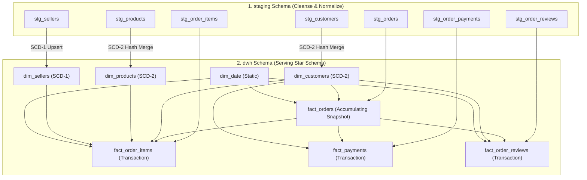

# 08. Data Warehouse Architecture & Physical Design

> **Focus:** Physical data warehouse layout for `ecommerce_dwh`, staging tables, physical DDL specifications, constraints, indexing, and ELT loading patterns.

---

## 1. Warehouse Architecture Overview

The analytical data warehouse `ecommerce_dwh` adopts a robust, two-tier architecture separating raw source-aligned staging from the analytical dimensional model:

```text
ecommerce_dwh/
├── staging/                # Tier 1: Source-aligned landing, type casting & cleansing layer
│   ├── stg_customers       # 1:1 clean representation of olist_customers_dataset
│   ├── stg_orders          # 1:1 clean representation of olist_orders_dataset
│   ├── stg_order_items     # 1:1 clean representation of olist_order_items_dataset
│   ├── stg_order_payments  # 1:1 clean representation of olist_order_payments_dataset
│   ├── stg_order_reviews   # 1:1 clean representation of olist_order_reviews_dataset
│   ├── stg_products        # 1:1 clean representation of olist_products_dataset (+ translations)
│   └── stg_sellers         # 1:1 clean representation of olist_sellers_dataset
└── dwh/                    # Tier 2: Target Kimball star schema dimensional layer
    ├── dim_customers       # SCD Type 2 customer dimension
    ├── dim_products        # SCD Type 2 product dimension
    ├── dim_sellers         # SCD Type 1 seller dimension
    ├── dim_date            # Conformed static date calendar dimension
    ├── fact_orders         # Accumulating snapshot fact (order fulfillment lifecycle)
    ├── fact_order_items    # Transaction fact (item level revenue & freight)
    ├── fact_payments       # Transaction fact (payment attempts, types, installments)
    └── fact_order_reviews  # Transaction / periodic fact (reviews & response SLA)
```

---

## 2. Schema Object Catalog

| Schema | Table Name | Architectural Role | Upstream Ingestion Source | Primary Key / Grain |
| :--- | :--- | :--- | :--- | :--- |
| `staging` | `stg_customers` | Staging Table | `olist_customers_dataset.csv` | `customer_id` (1 row per customer order token) |
| `staging` | `stg_orders` | Staging Table | `olist_orders_dataset.csv` | `order_id` (1 row per order) |
| `staging` | `stg_order_items` | Staging Table | `olist_order_items_dataset.csv` | `(order_id, order_item_id)` |
| `staging` | `stg_order_payments`| Staging Table | `olist_order_payments_dataset.csv`| `(order_id, payment_sequential)` |
| `staging` | `stg_order_reviews` | Staging Table | `olist_order_reviews_dataset.csv` | `review_id` / 1 row per review |
| `staging` | `stg_products` | Staging Table | `olist_products_dataset.csv` | `product_id` (1 row per SKU) |
| `staging` | `stg_sellers` | Staging Table | `olist_sellers_dataset.csv` | `seller_id` (1 row per merchant) |
| `dwh` | `dim_customers` | Dimension (SCD-2) | `staging.stg_customers` | `customer_key` (1 row per customer version) |
| `dwh` | `dim_products` | Dimension (SCD-2) | `staging.stg_products` | `product_key` (1 row per product version) |
| `dwh` | `dim_sellers` | Dimension (SCD-1) | `staging.stg_sellers` | `seller_key` (1 row per seller) |
| `dwh` | `dim_date` | Dimension (Static)| Date Generation Script | `date_key` (1 row per calendar day) |
| `dwh` | `fact_orders` | Fact (Accumulating) | `staging.stg_orders` + Dims | `order_key` (1 row per order lifecycle) |
| `dwh` | `fact_order_items` | Fact (Transaction) | `staging.stg_order_items` + Dims | `order_item_key` (1 row per line item) |
| `dwh` | `fact_payments` | Fact (Transaction) | `staging.stg_order_payments` + Dims | `payment_key` (1 row per payment sequence) |
| `dwh` | `fact_order_reviews` | Fact (Transaction) | `staging.stg_order_reviews` + Dims | `review_key` (1 row per review) |

---

## 3. End-to-End Lineage & Transformation Patterns



---

## 6. Optimization, Indexing & Partitioning Strategy

1. **Foreign Key Indexing:** Every foreign key in `fact_orders`, `fact_order_items`, `fact_payments`, and `fact_order_reviews` is indexed via B-tree to eliminate full table scans during star-join drilldowns.
2. **Date Partitioning:** At scale, `dwh.fact_orders` and `dwh.fact_order_items` are partitioned by `purchase_date_key` / `order_date_key` (monthly ranges) enabling instant partition pruning.
3. **Point-In-Time Surrogate Resolution:** During fact table loads, transactions resolve dimensions by matching the business key where `valid_from <= transaction_timestamp < valid_to` to guarantee temporal fidelity.
