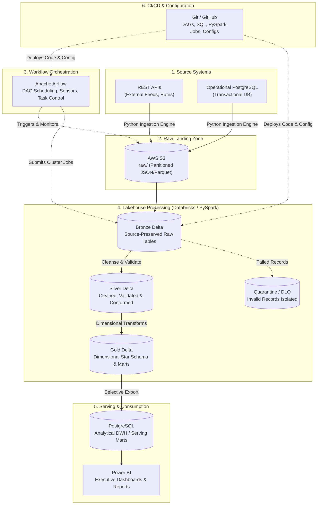
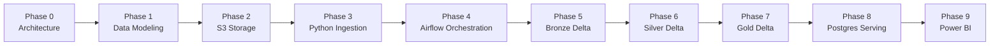
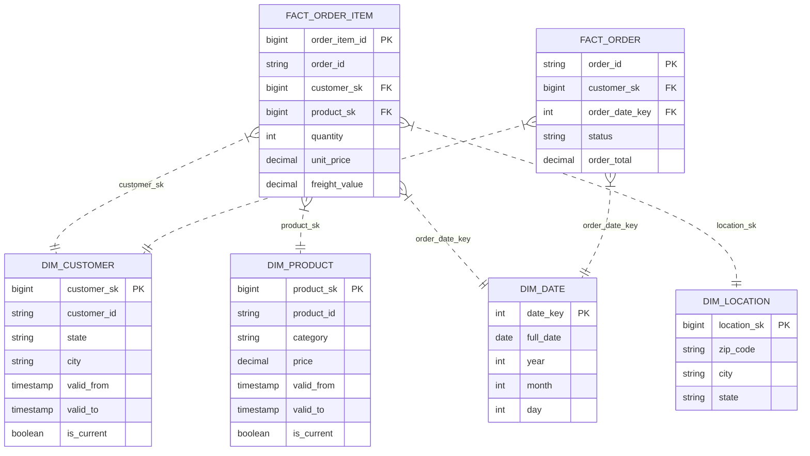
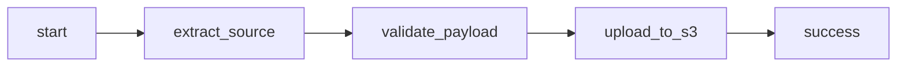
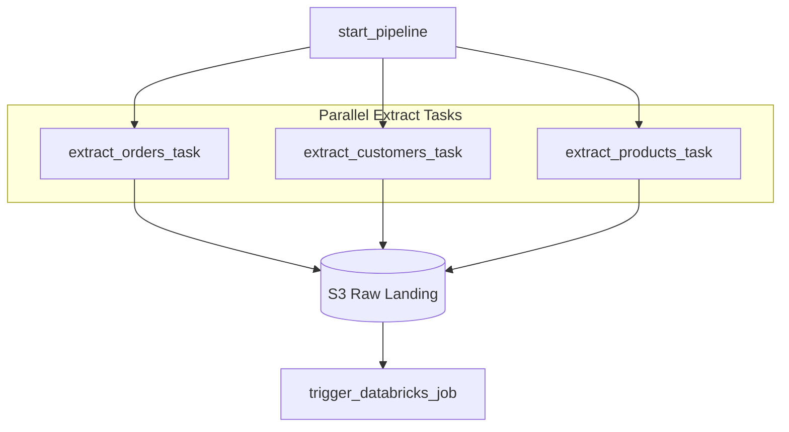
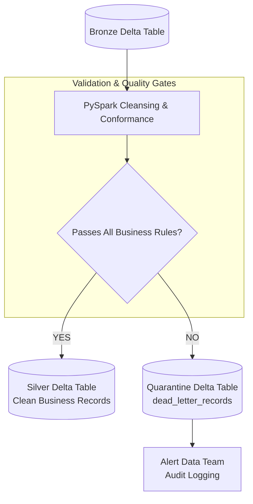
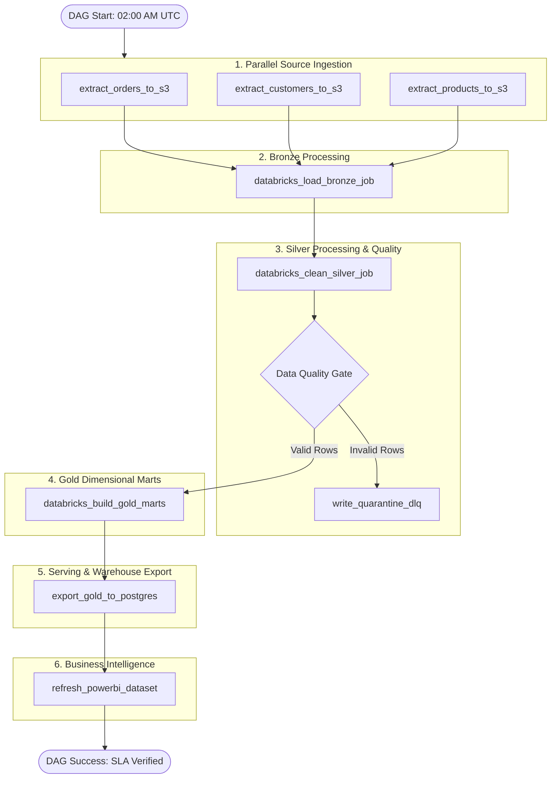

# Data Production Pipeline: End-to-End Design & Implementation Roadmap

> **Source Document:** Reconstructed and organized from `Private Designing.docx`  
> **Target Audience:** Data Engineers, Analytics Engineers, Platform Developers  
> **Core Stack:** REST API & PostgreSQL $\rightarrow$ AWS S3 $\rightarrow$ Apache Airflow $\rightarrow$ Databricks (PySpark / Delta Lake) $\rightarrow$ PostgreSQL (Serving DWH) $\rightarrow$ Power BI  
> **Code & Config Management:** Git & GitHub CI/CD

---

## Table of Contents
1. [End-to-End System Architecture](#1-end-to-end-system-architecture)
2. [Phase-by-Phase Implementation Roadmap](#2-phase-by-phase-implementation-roadmap)
   - [Phase 0: Architecture & Requirements Definition](#phase-0--architecture-first)
   - [Phase 1: Dimensional Data Modeling](#phase-1--data-modeling)
   - [Phase 2: Raw Storage Layer (AWS S3)](#phase-2--source--raw-aws-s3)
   - [Phase 3: Extraction & Ingestion Engine (Python)](#phase-3--build-ingestion-with-python)
   - [Phase 4: Workflow Orchestration (Apache Airflow)](#phase-4--workflow-orchestration-apache-airflow)
   - [Phase 5: S3 to Databricks (Bronze Delta Layer)](#phase-5--s3--databricks-bronze-delta)
   - [Phase 6: Data Cleansing, Validation & Quarantine (Silver Delta Layer)](#phase-6--bronze--silver-delta-cleansing--quarantine)
   - [Phase 7: Dimensional Aggregations & Business Marts (Gold Delta Layer)](#phase-7--silver--gold-delta-dimensional-marts)
   - [Phase 8: Analytical Serving Layer (PostgreSQL DWH)](#phase-8--gold--postgresql-serving-warehouse)
   - [Phase 9: Business Intelligence & Dashboards (Power BI)](#phase-9--power-bi-dashboards)
3. [Production Hardening & Reliability Engineering](#3-production-hardening--reliability-engineering)
   - [Incremental Processing Strategy](#31-incremental-processing-strategy)
   - [Idempotency & Safe Re-execution](#32-idempotency--safe-re-execution)
   - [Failure Recovery & Resiliency](#33-failure-recovery--resiliency)
   - [Automated Data Quality Contracts](#34-automated-data-quality-contracts)
   - [Logging, Metrics & Operational Observability](#35-logging-metrics--operational-observability)
4. [Target Orchestration Flow (Airflow DAG)](#4-target-orchestration-flow-airflow-dag)
5. [Standardized Repository Structure](#5-standardized-repository-structure)

---

## 1. End-to-End System Architecture

The batch data production pipeline follows a modern **Decoupled Lakehouse-to-Warehouse** pattern, leveraging **Apache Airflow** for orchestrating distributed workloads in **Databricks**, with immutable storage in **AWS S3** and high-speed relational serving in **PostgreSQL**.



---

## 2. Phase-by-Phase Implementation Roadmap

To avoid common pitfalls such as learning tools in isolation or over-engineering early, execute the project in strictly sequenced phases:



---

### Phase 0 — Architecture FIRST
> **Core Principle:** Never write DAGs or provision cloud infrastructure before establishing business contracts and scope.

Before touching Airflow, AWS, or Databricks, explicitly define:
- **Business Problem:** Build an automated daily analytical platform for e-commerce orders, customers, products, logistics, and revenue.
- **Source Systems:** Operational PostgreSQL and external REST APIs.
- **Data Frequency:** Daily batch scheduled off-peak.
- **Business KPIs:** Gross Revenue, Net Revenue, Orders, AOV, Customer Retention, On-Time Delivery Rate, Seller Performance.
- **Data Consumers:** Sales, Marketing, Operations, Finance, Executive Management, and BI Analysts.
- **SLA & Freshness:** All analytical marts refreshed, validated, and queryable by **07:00 AM daily**.
- **Historical Requirements:** Customer and product attributes must maintain historical accuracy across attribute changes (SCD Type 2).

---

### Phase 1 — Data Modeling
> **Core Principle:** Design the target dimensional model before engineering the extraction.

Develop the conformed dimensional model and determine the grain of every fact and dimension:



#### Modeling Checklist:
- [x] Establish Fact table grain (e.g., One row per individual item line within an order).
- [x] Define Primary Keys (PKs), Surrogate Keys (SKs), and Foreign Keys (FKs).
- [x] Formalize Slowly Changing Dimension (SCD Type 2) strategy for `dim_customer` and `dim_product`.
- [x] Classify numerical measures (Additive, Semi-Additive) vs. contextual dimensions.

---

### Phase 2 — Source $\rightarrow$ Raw (AWS S3)
> **Core Principle:** Learn only the pragmatic minimum AWS footprint required for the data tier.

Focus strictly on essential Amazon S3 capabilities:
- **Core Concepts:** Buckets, Objects, Prefixes, IAM Roles & Policies.
- **Security:** Least-privilege IAM policies, Server-Side Encryption (SSE-S3/KMS).
- **Data Organization:** Partition-style prefix paths:
  ```text
  s3://<project-bucket>/
  ├── raw/
  │   ├── orders/
  │   │   └── ingestion_date=YYYY-MM-DD/
  │   │       └── orders_001.json
  │   ├── customers/
  │   │   └── ingestion_date=YYYY-MM-DD/
  │   └── products/
  │       └── ingestion_date=YYYY-MM-DD/
  └── archive/
  ```
- **Lifecycle Policies:** Move raw data older than 90 days to S3 Glacier Flexible Retrieval.

---

### Phase 3 — Build Ingestion with Python
> **Core Principle:** Build standalone, testable extraction scripts before introducing the orchestrator.

Develop modular Python extractors connecting to PostgreSQL and external REST APIs:

```
Operational PostgreSQL / REST API
               │
               ▼
   [Python Ingestion Engine]
   • Config-driven (YAML/.env)
   • Structured JSON Logging
   • Exponential Backoff & Retries
   • Watermark Tracking (updated_at)
   • Checksum & Payload Validation
               │
               ▼
   AWS S3 Raw Storage (Partitioned)
```

#### Key Implementation Components:
- **Configuration Management:** Centralized settings via `pipeline_config.yaml` and environment variables.
- **Robust Error Handling:** Network timeout catching, cursor streaming for large DB queries.
- **Partitioned File Naming:** `orders/ingestion_date=2026-09-15/orders_001.json`.
- **Metadata Logging:** Capture record counts, extraction duration, and payload size.

---

### Phase 4 — Workflow Orchestration (Apache Airflow)
> **Core Principle:** Airflow is the orchestrator (the brain), not the execution engine (the muscle).

Start with a simple linear DAG to master the execution model, then expand to parallel branches:

#### Progression 1: Simple Linear DAG


#### Progression 2: Production Parallelized Ingestion DAG


#### Essential Airflow Concepts to Master:
- **Scheduling & Timers:** Cron expressions, `catchup=False`, execution dates vs. logical dates.
- **Tasks & Operators:** `PythonOperator`, `BashOperator`, `DatabricksSubmitRunOperator`.
- **State Management:** XComs (for light metadata passing), Airflow Connections & Variables.
- **Resilience:** `retries=3`, `retry_delay=timedelta(minutes=5)`, SLA miss callbacks, on-failure alerting hooks.

---

### Phase 5 — S3 $\rightarrow$ Databricks (Bronze Delta)
> **Core Principle:** Bronze preserves the raw source state in high-performance Delta Lake format.

- Ingest raw JSON/Parquet from S3 using Databricks Auto Loader or PySpark batch readers.
- Add audit metadata columns:
  - `_ingestion_timestamp`: UTC timestamp of write.
  - `_source_file`: Absolute S3 path of the ingested file.
  - `_batch_id`: Unique Airflow execution run ID.
- Store data as **Delta Lake** tables to gain ACID transactions and schema enforcement.

---

### Phase 6 — Bronze $\rightarrow$ Silver Delta (Cleansing & Quarantine)
> **Core Principle:** Never let invalid records enter analytical tables, and never let rejected rows vanish silently.

Perform structured schema conformance and business validation rules:



#### Silver Transformation Operations:
- **Type Casting:** Strings to `TimestampType`, `DecimalType(10,2)`, `IntegerType`.
- **Deduplication:** Window functions on natural keys partitioned by `updated_at DESC`.
- **Data Standardization:** Case conversions, stripping whitespace, ISO country/state code normalization.
- **Null Handling:** Replace null foreign keys with default unknown keys (`-1`).

---

### Phase 7 — Silver $\rightarrow$ Gold Delta (Dimensional Marts)
> **Core Principle:** Model for downstream analytical query performance and dimensional star schemas.

Transform conformed Silver tables into business-ready dimensional marts:
- **Fact Tables:** `fact_orders`, `fact_order_items`, `fact_payments`.
- **Dimension Tables:** `dim_customers` (SCD-2), `dim_products` (SCD-2), `dim_sellers`, `dim_date`, `dim_location`.
- **Pre-aggregated Rollups (Marts):**
  - `mart_daily_sales_revenue`
  - `mart_customer_retention_cohorts`
  - `mart_delivery_logistics_sla`

---

### Phase 8 — Gold $\rightarrow$ PostgreSQL (Serving Warehouse)
> **Core Principle:** Export only data that requires high-concurrency relational querying.

- **Do not** replicate entire data lakes into PostgreSQL.
- Selectively sync curated Gold dimension tables and aggregated analytical marts into PostgreSQL.
- Use bulk loading (`COPY` or fast parallel JDBC writers) with staging swap tables for atomic updates.

---

### Phase 9 — Power BI Dashboards
> **Core Principle:** Analytical pipelines must serve end-user business decisions.

Connect Power BI to the serving PostgreSQL warehouse:
- **Sales Executive Dashboard:** Daily/monthly GMV, AOV, top product categories, discount margin impacts.
- **Logistics & Operations Scorecard:** Average delivery time, on-time delivery rate by courier, freight cost per state.
- **Customer Lifetime Value & Retention Report:** Cohort repeat purchase trends, churn rate, regional customer distribution.

---

## 3. Production Hardening & Reliability Engineering

Building a "happy path" script is easy; enterprise production engineering requires bulletproofing against real-world failures:

### 3.1 Incremental Processing Strategy
Eliminate full-table scans. Replace:
$$\text{Read All Data} \longrightarrow \text{Process All Data (Anti-pattern)}$$
With watermark-driven incremental CDC extraction:
$$\text{New/Changed Data} \longrightarrow \text{Incremental Transformation} \longrightarrow \text{Atomic MERGE / Upsert}$$

```sql
-- Idempotent Delta Lake MERGE pattern in Databricks PySpark
MERGE INTO silver_orders AS target
USING incremental_staged_orders AS source
ON target.order_id = source.order_id
WHEN MATCHED AND source.updated_at > target.updated_at THEN
  UPDATE SET *
WHEN NOT MATCHED THEN
  INSERT *;
```

---

### 3.2 Idempotency & Safe Re-execution
Executing any pipeline run multiple times with identical parameters must produce the exact same target state:

```
Run 1 (Initial Run)  ──────▶ Loaded 1,000 records  (Target Count = 1,000)
Run 2 (Manual Retry) ──────▶ Merged 1,000 records  (Target Count = 1,000)  ✅
                                                   (Target Count = 2,000)  ❌ CORRUPT!
```

- **Partition Overwrites:** Use deterministic partitions (`ingestion_date=YYYY-MM-DD`).
- **Surrogate Key Determinism:** Generate deterministic hashes (e.g., `SHA256(customer_id + valid_from)`) rather than auto-incrementing integers.

---

### 3.3 Failure Recovery & Resiliency
Design for partial pipeline failures:

```
Step 1: Ingest to S3        ──▶ [ SUCCESS ✅ ]
Step 2: Bronze Delta        ──▶ [ SUCCESS ✅ ]
Step 3: Silver Cleansing    ──▶ [ FAILED  ❌ ]
Step 4: Gold Marts          ──▶ [ SKIPPED ⏸️ ]
```

- **Clean Recovery:** Retrying the failed DAG from Step 3 must succeed without manual cleanup and without duplicating data in Bronze.
- **Transaction Rollback:** Staging tables and Delta Lake ACID transactions prevent half-written batches from being exposed to BI consumers.

---

### 3.4 Automated Data Quality Contracts
Enforce non-negotiable data quality checks before promoting rows to Silver:

| Rule Target | Validation Check | Severity | Action on Failure |
| :--- | :--- | :--- | :--- |
| `order_id` | `IS NOT NULL AND length(order_id) > 0` | Critical | Divert to Quarantine |
| `unit_price`, `quantity` | `quantity > 0 AND unit_price >= 0` | High | Divert to Quarantine |
| `customer_id` | Referential integrity check against master | Medium | Assign `UNKNOWN` SK (`-1`) & Alert |
| Duplicate `order_id` | Uniqueness validation on natural key | Critical | Deduplicate by highest `updated_at` |
| `delivered_date` | `delivered_date >= order_purchase_date` | High | Flag anomaly $\rightarrow$ Quarantine |

---

### 3.5 Logging, Metrics & Operational Observability
A production pipeline must log structured execution metrics at every stage:

```text
[2026-09-15 02:00:01] [INFO] Pipeline Run ID: run_20260915_020000 STARTED
[2026-09-15 02:05:12] [INFO] Extracted: 120,432 records from source PostgreSQL
[2026-09-15 02:07:30] [INFO] Uploaded: 120,432 records to s3://project-bucket/raw/orders/
[2026-09-15 02:18:45] [INFO] Bronze Table Loaded: 120,432 records
[2026-09-15 02:35:10] [INFO] Silver Processing: 119,981 clean records passed quality gate
[2026-09-15 02:35:11] [WARN] Silver Quarantine: 451 invalid records diverted to DLQ
[2026-09-15 02:48:22] [INFO] Gold Dimensional Marts updated successfully
[2026-09-15 02:55:00] [INFO] PostgreSQL Serving Layer synced: 119,981 records
[2026-09-15 02:55:01] [INFO] Pipeline COMPLETED in 55m 00s. SLA Met (Target: 07:00 AM).
```

---

## 4. Target Orchestration Flow (Airflow DAG)



---

## 5. Standardized Repository Structure

The production codebase is organized according to separation-of-concerns principles:

```text
ecommerce-data-platform/
│
├── README.md                          # Repository overview and setup instructions
├── DATA_PIPELINE_SPECIFICATION.md     # Business requirements, KPIs, and data contracts
├── Private Designing.md               # End-to-end architecture & phased implementation roadmap
│
├── docs/                              # Technical architecture and decision records
│   ├── architecture/
│   │   ├── architecture.png           # High-level architecture diagram
│   │   └── architecture.md            # Infrastructure & network topologies
│   ├── data-model/
│   │   ├── erd.png                    # Entity-Relationship diagram
│   │   └── dimensional-model.md       # Grain, facts, and SCD-2 specifications
│   └── decisions/                     # Architecture Decision Records (ADRs)
│       ├── incremental-loading.md     # Rationale for watermark vs. log-based CDC
│       ├── partitioning.md            # Partitioning and clustering strategies
│       └── error-handling.md          # Quarantine / DLQ design principles
│
├── dags/                              # Apache Airflow workflow DAGs
│   ├── ecommerce_pipeline.py          # Master daily batch orchestration DAG
│   └── backfill_pipeline.py           # Historical backfill and bootstrap DAG
│
├── src/                               # Modular Python application packages
│   ├── ingestion/
│   │   ├── postgres_ingestion.py      # Off-peak PostgreSQL extractor
│   │   ├── api_ingestion.py           # Rate-limited REST API fetcher
│   │   └── s3_uploader.py             # S3 multi-part uploader with checksum validation
│   ├── validation/
│   │   ├── quality_checks.py          # Data contract rules & schema assertions
│   │   └── quarantine_handler.py      # Dead letter queue dispatcher
│   └── utils/
│       ├── logging.py                 # Structured JSON logger
│       └── db_connections.py          # Connection pooling & retry decorators
│
├── databricks/                        # PySpark & Delta Lake transformation notebooks/scripts
│   ├── bronze/
│   │   └── load_raw_to_bronze.py      # S3 landing to Bronze Delta tables
│   ├── silver/
│   │   ├── clean_orders.py            # Deduplication, typing & business validation
│   │   └── scd2_customers.py          # SCD Type 2 dimension merge logic
│   └── gold/
│       ├── build_fact_orders.py       # Fact order item assembly
│       └── build_sales_marts.py       # Aggregated business marts
│
├── sql/                               # Pure SQL assets and DDL definitions
│   ├── ddl/
│   │   ├── create_silver_tables.sql   # Silver schema definitions
│   │   ├── create_gold_tables.sql     # Gold dimensional schema DDL
│   │   └── create_postgres_marts.sql  # Serving warehouse DDL
│   ├── transformations/               # Complex analytical queries & views
│   └── validation/                    # SQL-based reconciliation queries
│
├── tests/                             # Automated testing suite
│   ├── test_ingestion.py              # Unit tests for extractors and retry logic
│   ├── test_transformations.py        # PySpark transform logic tests using fixtures
│   └── test_data_quality.py           # Assertion tests for DQ rules
│
├── config/                            # Environment-specific configuration
│   ├── pipeline_config.yaml           # Extraction limits, batch sizes, S3 paths
│   └── dev.env                        # Local development environment variables
│
└── .gitignore                         # Exclude secrets, credentials, and venvs
```

---

## 6. Summary Checklist for Developers

| Milestone | Key Deliverable | Success Criteria |
| :--- | :--- | :--- |
| **Phase 0** | Architecture Document | Business problem, KPIs, 7:00 AM SLA, and consumers signed off. |
| **Phase 1** | Dimensional Model | Star schema ERD designed with explicit SCD-2 strategy. |
| **Phase 2** | S3 Setup | Partitioned prefix structure (`raw/orders/ingestion_date=...`) deployed. |
| **Phase 3** | Python Ingestion | Standalone extractors running with retries and structured logging. |
| **Phase 4** | Airflow DAG | Directed acyclic graph scheduling extractions with proper dependencies. |
| **Phase 5** | Bronze Delta | Raw JSON/Parquet ingested into source-preserved Delta tables. |
| **Phase 6** | Silver Cleansing | Type-cast, deduplicated records with quarantine DLQ for bad rows. |
| **Phase 7** | Gold Marts | Dimensional fact/dim tables and aggregated reporting tables built. |
| **Phase 8** | Postgres Serving | High-performance sync of Gold datasets into relational tables. |
| **Phase 9** | Power BI | Executive and operational dashboards answering core business questions. |
